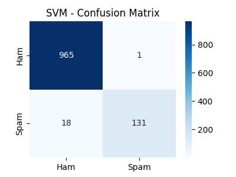
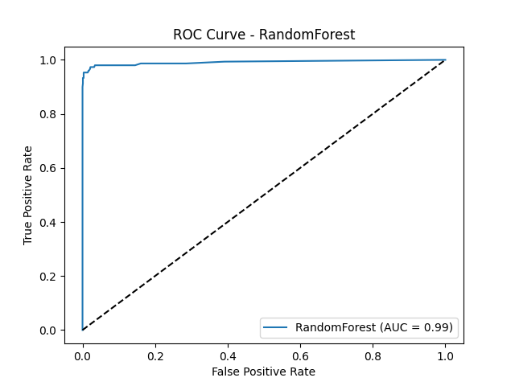
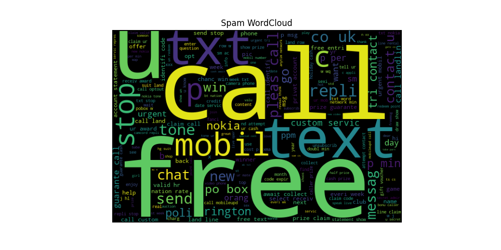

# 📧 Spam Mail Detector (Pro+ Version)


## 📌 Overview
Spam emails are one of the biggest nuisances in communication today.  
This project is a **Spam Mail Detector** that classifies messages as **Spam** or **Ham** using advanced **Machine Learning** and **Natural Language Processing (NLP)** techniques.  

The **Pro+ Version** includes:  
- Text cleaning (stopwords removal, stemming)  
- TF-IDF feature extraction  
- Multiple ML models (Naive Bayes, Logistic Regression, SVM, Random Forest)  
- Cross-validation & hyperparameter tuning (optimized with `RandomizedSearchCV`)  
- Evaluation with **classification reports, confusion matrices, ROC curves**  
- **WordCloud visualizations** of spam vs ham messages  
- Saves best tuned models (`SVM` & `Random Forest`) for future predictions  


## ⚙️ Installation

1. Clone this repository:
   ```bash
   git clone https://github.com/Mayank230604/spam_detector_pro.git
   cd spam_detector_pro
   ````

2. Create a virtual environment (optional but recommended):

   ```bash
   python -m venv venv
   source venv/bin/activate    # Mac/Linux
   venv\Scripts\activate       # Windows
   ```

3. Install dependencies:

   ```bash
   pip install -r requirements.txt
   ```

---

## ▶️ Run Instructions

1. Place the dataset (`spam.csv`) inside the `data/` folder.
   You can get the dataset from the [SMS Spam Collection Dataset](https://www.kaggle.com/uciml/sms-spam-collection-dataset).

2. Run the main script:

   ```bash
   python src/spam_mail_detector.py
   ```

3. Outputs:

   * **Confusion Matrices** → stored in `figures/`
   * **ROC Curves** → stored in `figures/`
   * **WordClouds** → stored in `figures/`
   * **Best Models** → stored in `models/` (`best_svm_model.pkl`, `best_rf_model.pkl`)

---

## 📊 Results

| Model               | CV Accuracy | Test Accuracy |
| ------------------- | ----------- | ------------- |
| Naive Bayes         | \~0.97      | \~0.98        |
| Logistic Regression | \~0.96      | \~0.97        |
| SVM                 | \~0.98      | \~0.98        |
| Random Forest       | \~0.97      | \~0.98        |

✔️ SVM & RandomForest performed the best after hyperparameter tuning.

---

## 🌐 Visualizations

Some visual examples (all saved in the `figures/` folder):

### 🔹 Confusion Matrix (SVM)



### 🔹 ROC Curve (Random Forest)



### 🔹 Spam WordCloud



---

## 🚀 Future Improvements

* Deploy the model as a **Flask/Django web app**
* Create a **streamlit UI** for uploading & classifying emails
* Expand dataset with real-world spam messages
* Integrate deep learning models (RNNs, LSTMs, Transformers)

---
